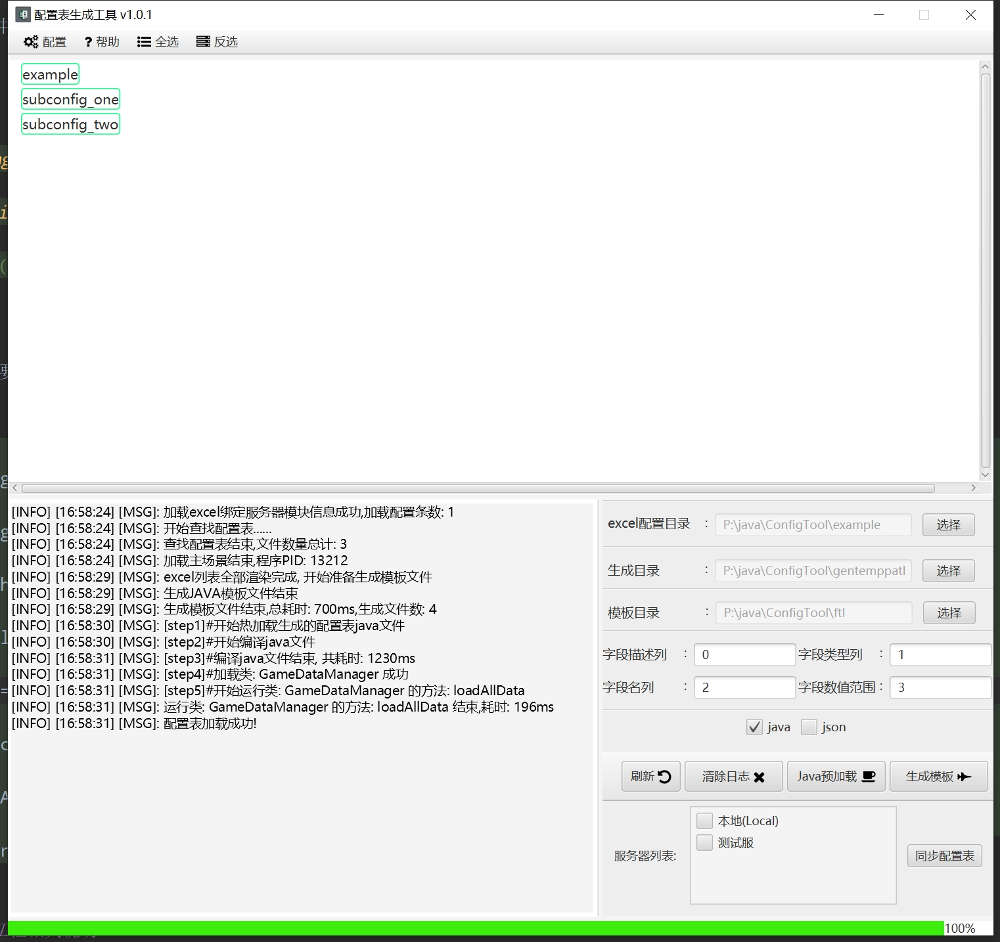
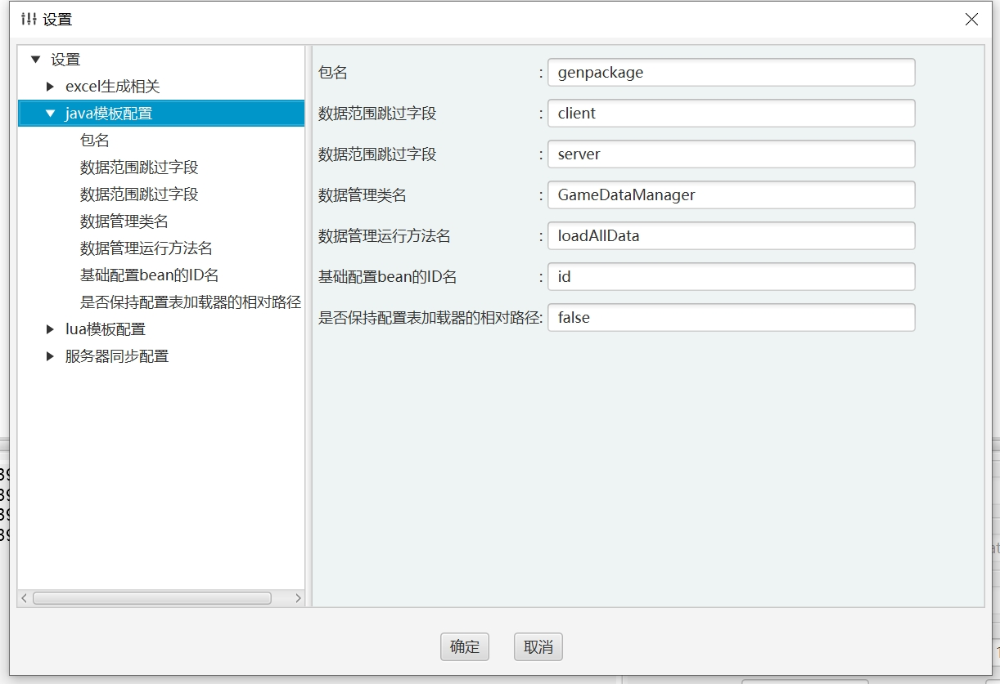
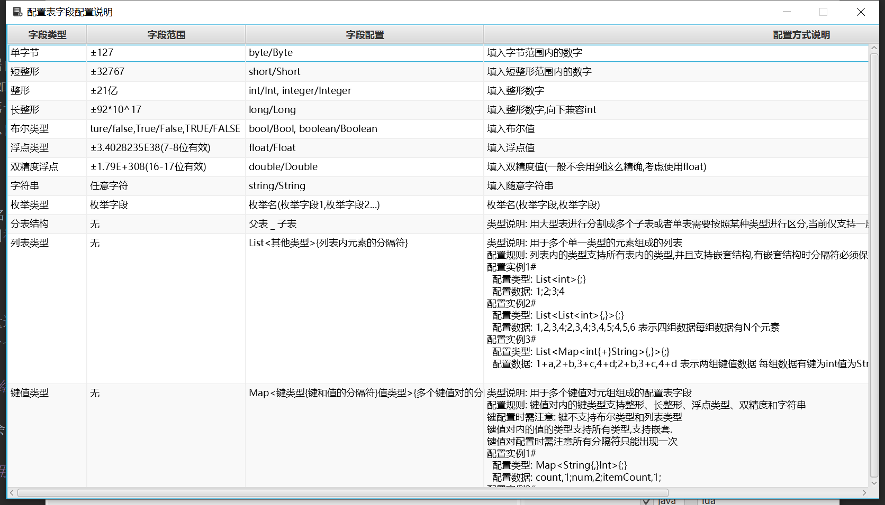

<h1 align="center">配置表工具</h1> 


# GameConfigTool

本工具用于excel游戏配置表的导出和相关语言的读写代码的导出.且基于javafx实现,可视化界面对策划和程序会更加友好,支持单表多表批量导出.

# 功能特性

1. 支持生成多种加载excel数据的代码,使用数据管理中心的方式对表数据进行管理.友好的配置数据读取方式
2. 生成时配置表格式检查,字段检查.便于早期发现问题
3. 支持配置表上传功能.生成->检查->上传
4. 使用多线程处理,加速模板的生成.数据加载时也支持加速
5. 更多的功能设置,方便多场景使用.支持按目录结构进行读取,可保留excel目录进行读取,可选配置项
6. 支持分表结构
7. 支持预检查,用于配置表中的数据检查
8. <span id="multiLan"></span> 支持配置表数据分端导出,单个字段可控制导出限制,客户端(json)和服务端(java)

# 配置注意事项

1. 由于不同的项目excel配置行表示的意义不一致,但基础的行数据不能缺省,此配置表需要四个字段表示行进行模板配置,行数不定可配置.分别为:
字段描述行、字段类型行、字段名行以及字段数据范围行
2. 配置工具只会读取excel的第一个工作薄中的数据内容,且生成出来的后的配置bean将以工作薄中的名字+cfg为类名,如工作薄名为Activity则最终的配置实例名则为:```ActivityCfg```,如果工作薄名为ActivityCfg则直接以该名字作为类名
3. 所有配置表的第一列必须为ID列,且id列的命名为```id``` ,id列的名字是可配置项,如果不配置默认为```id```

## 字段命名

1. 字段的命名开头不能以数字或者其他特殊字符开头'_'除外,可用'_'开头但不建议
2. 字段如果以'_'连接,是否需要转为驼峰命名可在配置中进行设置

## 字段类型配置说明

字段类型支持常见的类型,不同的类型在不同的语言中表示不同,后续将进行扩展

| 字段说明  | 字段表示                  | 配置表中对应的字段                       | 范围                    | 是否是基础字段 |
|-------|-----------------------|:--------------------------------|-----------------------|:--------|
| 整形    | java(int/Integer)     | int/Int                         | ±21亿                  | 是       |
| 单字节   | java(byte/Byte)       | byte/Byte                       | -128-127              | 是       |
| 短整型   | java(short/Shot)      | short/Short                     | -32768-32767          | 是       |
| 长整形   | java(long/Long)       | long/Long                       | ±92*10^17             | 是       |
| 布尔类型  | java(boolean/Boolean) | boo/Bool/boolean/Boolean        | true/false/TURE/FALSE | 是       |
| 字符串类型 | java(String)          | string/String                   |                       | 是       |
| 浮点型   | java(float/Float)     | float/Float                     | ±3.4028235E38(7-8位有效) | 是       |
| 双精度   | java(double/Double)   | double/Double                   | ±1.79E+308(16-17位有效)  | 是       |
| 列表    | java(List)            | list/List                       |                       | 否       |
| 不重复列表 | java(Set)             | set/Set                         |                       | 否       |
| 键值对   | java(Map)             | map/Map                         |                       | 否       |
| 枚举类型  | java(Enum)            | 使用```枚举名(枚举字段,枚举字段)```方式表示为一个枚举 |                       | 否       |

more:

1. 每种字段的数据配置方式参见配置表工具中 (帮助->配置表说明) 有更详尽的说明和示例,
2. 其中键值对的key不能放入非基础类型之外的类型和布尔类型,否则会抛出异常进行提示.
3. 列表类型和键值对类型支持嵌套结构,不限深度(但不建议超过三层).
4. 列表和键值对类型支持长度限制,配置方式是在最后一个隔离符后面配置长度,格式形似```{,10}分隔符为,并且限制长度为5个元素```

## 检查规则

1. 工具会检查数据内容是否和字段配置的类型是否一致
2. 兼容int情况,如果int行读取的配置为浮点数则直接向下取整
3. 每个配置表的第一列必须为ID列,不会检查格式可缺省字段类型,默认为int.
4. 字段说明行可以自定义行,但是最大的字段说明行必须紧挨着数据行,详情见实例Excel

## 分表说明

分表通过excel表名进行区分,如果表名中包含字符`_`,则说明是一个分表.现在只支持两层结构,后续支持多层结构的分表.通过`_`进行分隔`_`前的一致的表则视为同一组分表.

**注意: 分表内的字段名不能重复！**

### 适用情景

1. 同一张表数据量过大
2. 表数据可按某一个类型进行区分

### 生成后的代码结构表现

如果有两张分表则会生成三张表,两张字表和一张总表,总表拥有所有子表的数据,子表也有各自对应表的数据.

# 配置示例

1. 为了便于参考,项目中放置了一份基础的excel文档,罗列了一些基本用法.[参考文档](example/example.xlsx)

# 配置表excel结构放置说明

工具支持将策划使用的配置目录映射到到程序使用的工程目录，详细配置文件在```ExcelDirBindServerModuleConfLocal.txt```中

# 工具界面

1. 主界面
   
2. 设置界面
   
3. 配置表说明界面
   

# 启动参数

由于使用到反射功能,需要开放部分模块.在项目启动时需要额外添加如下启动参数

```text
--add-opens
java.base/java.lang=ALL-UNNAMED
--add-opens
java.base/java.lang.invoke=ALL-UNNAMED
--add-opens
java.base/java.math=ALL-UNNAMED
--add-opens
java.base/java.util=ALL-UNNAMED
--add-opens
java.base/java.nio=ALL-UNNAMED
--add-opens
java.base/sun.nio.ch=ALL-UNNAMED
--add-opens
java.base/java.io=ALL-UNNAMED
--add-opens
java.rmi/sun.rmi.transport=ALL-UNNAMED
```

# 生成模板文件后引入工程相关说明

## java

在java模板生成后,引用到的项目pom文件中需要添加如下依赖

```xml
<?xml version="1.0" encoding="UTF-8" ?>
<dependencies>
	<!--日志-->
	<dependency>
		<groupId>ch.qos.logback</groupId>
		<artifactId>logback-classic</artifactId>
		<version>1.2.11</version>
	</dependency>
	<!--excel解析-->
	<dependency>
		<groupId>org.apache.poi</groupId>
		<artifactId>poi</artifactId>
		<version>4.1.2</version>
	</dependency>
	<!--excel解析-->
	<dependency>
		<groupId>org.apache.poi</groupId>
		<artifactId>poi-ooxml</artifactId>
		<version>4.1.2</version>
	</dependency>
</dependencies>
```

# TODO

1. [多语言支持](#multiLan)后续支持多语言扩展和选择.
2. 程序命令行支持
