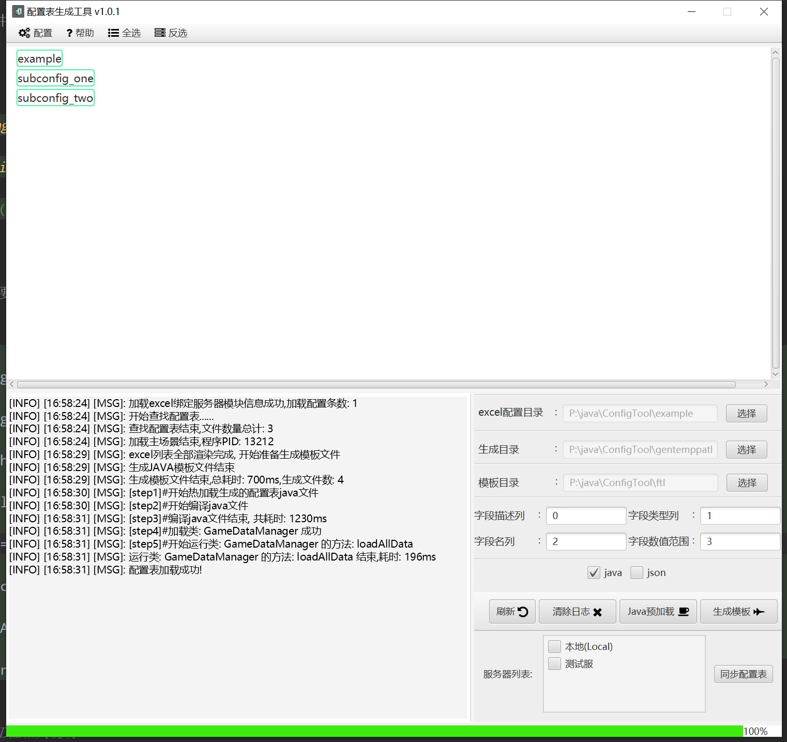
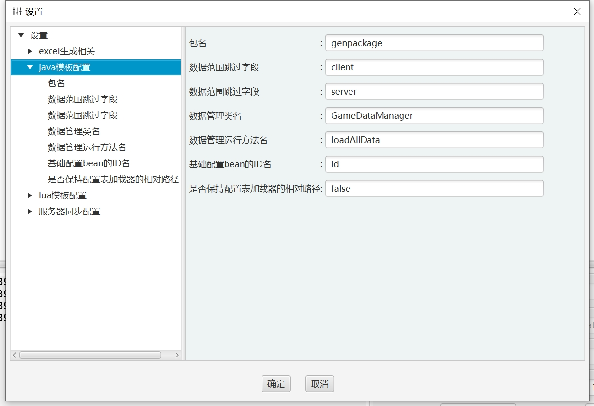
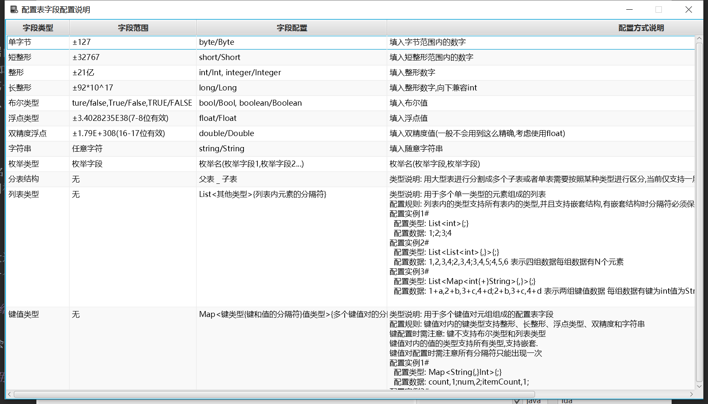

<h1 align="center">配置表工具</h1> 

[简体中文](README.md) | [English](README_EN.md)

# GameConfigTool

将 Excel 游戏配置表导出为多种语言的**读取代码**与**数据文件**. 基于 JavaFX 实现可视化界面, 支持单表/多表批量导出, 生成过程中同步完成配置表的格式与数据检查.

# 支持的导出语言

| 语言 | `--lang` 标识 | 说明 |
|------|------|------|
| Java | `java` | 默认导出语言 |
| JSON | `json` | 表数据的 JSON 形式, 非GUI模式会固定追加以保证完整走一次检查 |
| Go | `go` | |
| Rust | `rust` | |
| C# | `csharp` | |
| Lua | `lua` | |
| C++ | `cpp` | |

支持一次选择多个语言导出, 生成结果按语言分目录存放.

# 优势

1. **简易** — 界面点一下就能导出, 也可以用一条命令跑完; 生成的代码自带数据管理中心, 读取配置简单直观.
2. **灵活** — 支持 7 种语言(可多语言同时导出), 支持分表、客户端/服务端分端导出、常量配置、Excel 目录映射、预检查等, 适配多种项目场景.
3. **策划友好** — 直接写 Excel 就能配置, 字段描述行/类型行/数据范围行的填写方式清晰统一, 生成前先做一次格式与数据检查, 问题在早期暴露.

# 运行截图

1. 主界面
   
2. 设置界面
   
3. 配置表说明界面
   

# 文档

- [配置说明](doc/configuration.md) — 表的填写规范、字段类型、检查规则、分表规则、生成结果如何引入工程
- [命令行用法](doc/usage.md) — 非GUI(命令行)模式的参数、示例与退出码

# TODO

~~1. 多语言支持(界面多语言扩展和选择).~~
~~2. 程序命令行支持.~~
3. 配置界面数组配置的展示组件.
